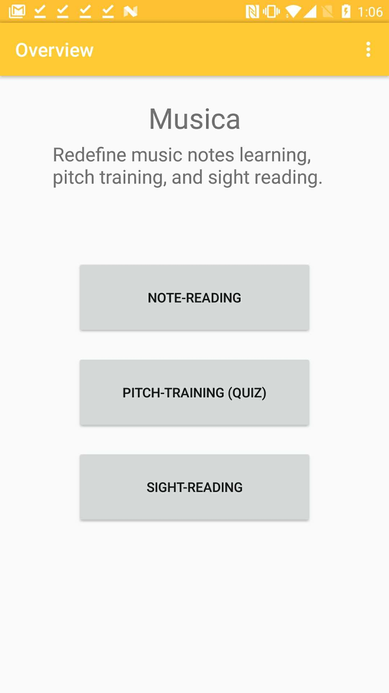
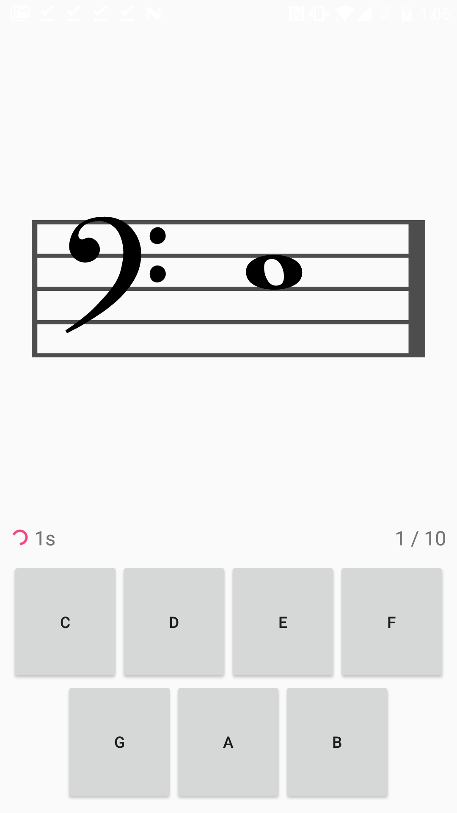
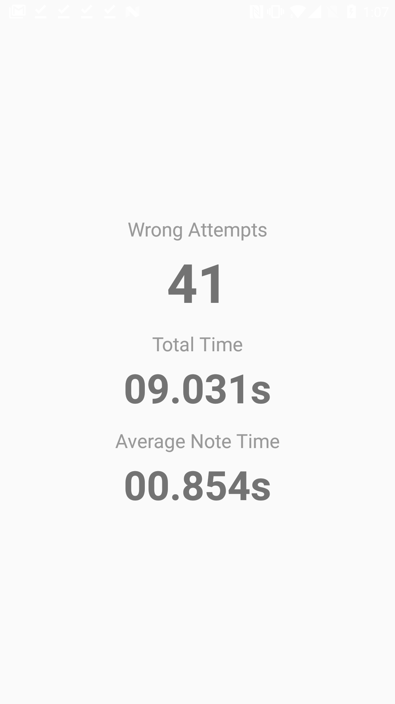
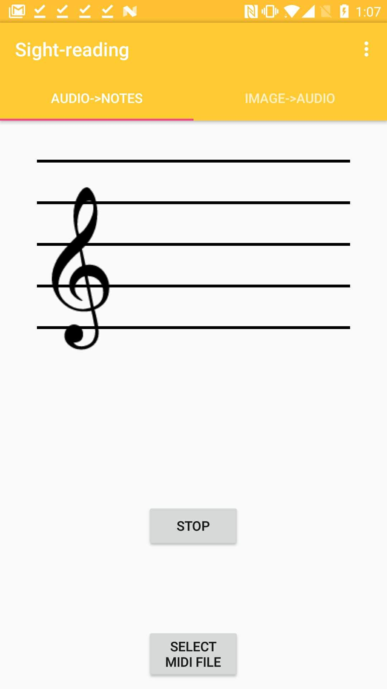
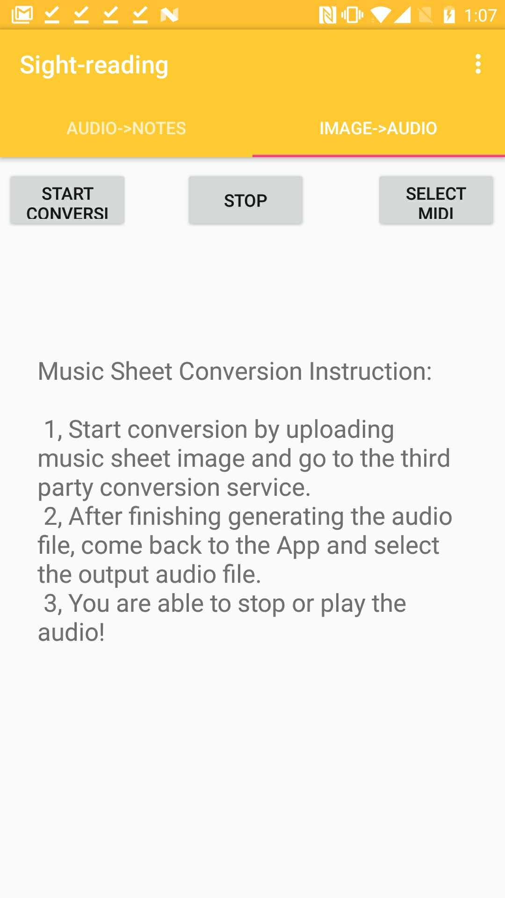
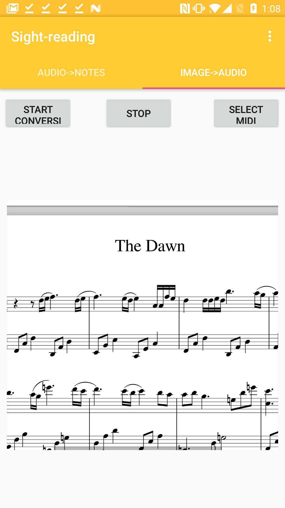

# Musica
The way of compiling and run the App is simple. All you need to do is 
cloning all the content in this repo and open up the source files in 
Android Studio. Then you are able to utilize all the functionalities. 
All the features are tested and run locally in each one's machine before
Musica is published to Google Play.
#### Musica is a music learning App for people who would like to learn:
- note-reading
- pitch-training
- sight-reading

## Note-reading:
The note-reading feature is achieved by a five-line user interface. The user 
is able to tap on any position in the five lines. Correspondingly, Musica is 
able to play the pitch of the note being tapped.

We have also provide the recording feature that is able to record the pitches 
that the users have tapped.

## Pitch-training:
The pitch-training feature is essentially a quiz mode in the Musica App. The 
user is able to enter the quiz mode by tapping on the quiz button in the 
navigation page. Then Musica would show up a five-line page and all possible 
answers for each music note shown in the five lines. The user is responsible 
for tapping the correct name of the note in order to pass the quiz question.

## Sight-reading:
By alleviating the technology barriers, the sight-reading assistance is 
completed by recognizing audio files and output the correct music sheets, 
and thus the users are able to compare their sight-reading result with 
correct sight-reading.

We have also utilize the muse score service to convert the pdf music sheet
into the audio files.

